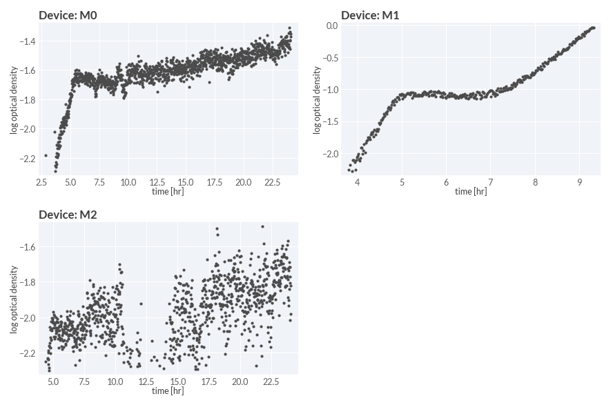

# 2024-04-18 Glucose-Acetate Shift

## Purpose
This experiment was undertaken to assess the technical reproducibility of the 
Chi.Bio bioreactor system. Additionally, we ran this experiment to approximately 
measure the instantaneous growth rate throughout a glucose-acetate diauxic shift. 

## Materials

### Growth Media
| **Label** | **Buffer Base** | **Carbon Source & Concentration** |
|:--:|:--:|:--:|
| glucose-acetate shift | N-C- + micronutrients | 0.5 mM glucose + 30 mM acetate|
| glucose-acetate preshift | N-C- + micronutrients | 10 mM glucose + 30 mM acetate + 0.1% LB|

### Strains 
| **Label** | **Parent Strain**|  **Genotype** | **Location(s)**|
|:--: | :--:| :--:| :--:|
|WT| NCM3722 | | `GC001`|

### Instrument

| **Instrument** | **Chi.Bio Incubator + Measurement System**|
|:--:| :--:|
| Temperature | 37° C|
| Stirring Speed (relative)| 0.75 |
| 395nm LED Intensity [a.u.] | 0 |
| 457nm LED Intensity [a.u.] | 0 |
| 500nm LED Intensity [a.u.] | 0 |
| 595nm LED Intensity [a.u.] | 0 |
| 623nm LED Intensity [a.u.] | 0 |
| 6500K LED Intensity [a.u.] |  0 |
| 650nm Laser Intensity [a.u.] | 0.5 |
| 280nm LED Intensity [a.u.] | 0 |
| Turbidity Regulation | None |
| Optical Density Target | N/A| 
| Read Interval | 60s|

### Growth Labels

| **Vessel ID** | **Strain** | **Growth Medium** | **Turbidostat Control** |
|:--:|:--:|:--:|:--:|
| `M0` | WT | glucose-acetate shift | False |
| `M1` | WT | glucose-acetate shift | False |
| `M2` | WT | glucose-acetate shift | False |

## Protocol

1. Four assembled cultivation vessels with 3-port lids were washed with ddH$_2$O
and sterilized with 70% EtOH. Vessels, lids, stir bars, and tubes were dried with 
filtered air. 

2. One assembled vessels was selected for growing the preculture. To this vessel,
20 mL of N-C- + micronutrients + 30 mM acetate medium was added along with 200 µL 
of 1M glucose and 20 µL of LB to make a glucose-acetate preshift medium. To the three other vessels,
20 mL of N-C- + micronutrients + 30 mM acetate medium was added along with 10 µL 
of 1M glucose to make a glucose-acetate shift medium. These three vessels were 
sealed with tubing and transferred to the 37° C air incubator to preheat until 
the experiment was begun.

3. A large colony from a fresh `GC001` plate was added to the vessel using an 
incoculation loop. The exterior glass of the vessels was cleaned with 70% EtOH
and dried, then transferred to the bioreactor. The software was instantiated and
the vessel was allowed to then preheat and stir until the temperature reached a
stable value around 37° C. After 10 min, the stirring was deactivated and the
zero value for the OD650nm was set. 

4. The batch growth cycle was then initiated with strong stirring and OD650nm 
measurements taken every 60 seconds. This culture was allowed to grow for 3.5 hours 
until an optical density of approximately 0.4 was reached. 

5. The preculture growth cycle was terminated and the vessel was removed. The 
main culture vessels were removed from the 37 °C air incubator and the glass 
exterior of each was sterilized with 70% EtOH and dried with a kimwipe. They
were transferred to the bioreactor and the temperature control was set to 37 °C
with vigorous stirring.  After 10 min, the stirring was ceased and allowed to rest 
for 60 s. The OD650nm zero was then set independently for each vessel.

6. While the main culture tubes were equilibrating, 2 mL of the preculture was 
removed from the vessel and transfered into 1mL aliquots into eppendorf tubes. 
Cells were pelleted for 1 min at 21000 rcf. The supernatant was removed and the 
pellets were resuspended in 1 mL N-C- + micronutrients + 10 mM NH$_4$Cl + 30 mM acetate.
This step was repeated two more times for a total of three washes.

7. After the final wash, both pellets were resuspended into a total volume of 1 mL 
N-C- + micronutrients + 10 mM NH$_4$Cl + 30 mM acetate.

8. Approximately 200 µL of  the resuspended cells were loaded into a 1mL syringe 
and were injected into each culture vessel. The measurements were then initiated 
and the system was allowed to grow overnight. 

## Results
It appears that only one of the three replicates worked, in that a diauxic shift 
was observed. 

### Growth Curves
