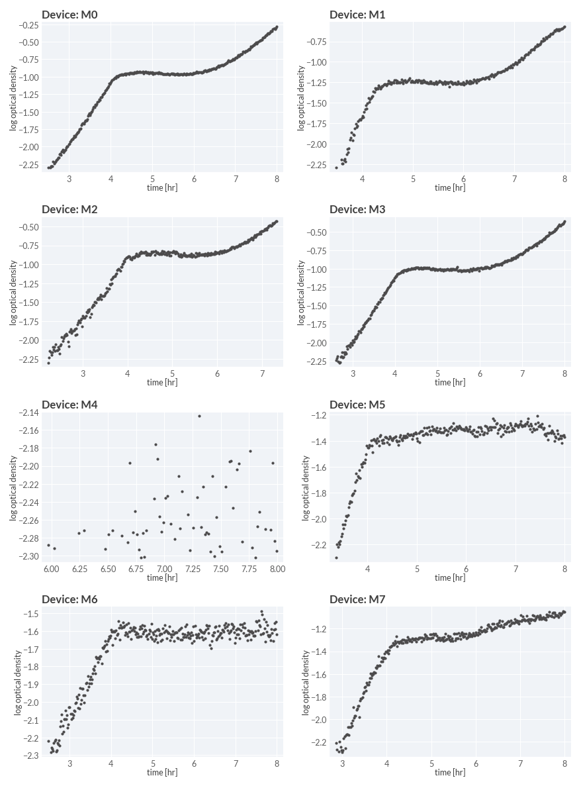

# 2024-04-22 Glucose-Acetate Shift

## Purpose
This experiment was undertaken to assess the technical reproducibility of the 
Chi.Bio bioreactor system. Additionally, we ran this experiment to approximately 
measure the instantaneous growth rate throughout a glucose-acetate diauxic shift. 

## Materials

### Growth Media
| **Label** | **Buffer Base** | **Carbon Source & Concentration** |
|:--:|:--:|:--:|
| glucose-acetate shift | N-C- + micronutrients | 0.5 mM glucose + 30 mM acetate|
| glucose-acetate preshift | N-C- + micronutrients | 10 mM glucose + 30 mM acetate + 0.1% LB|

### Strains 
| **Label** | **Parent Strain**|  **Genotype** | **Location(s)**|
|:--: | :--:| :--:| :--:|
|WT| NCM3722 | | `GC001`|

### Instrument

| **Instrument** | **Chi.Bio Incubator + Measurement System**|
|:--:| :--:|
| Temperature | 37° C|
| Stirring Speed (relative)| 0.75 |
| 395nm LED Intensity [a.u.] | 0 |
| 457nm LED Intensity [a.u.] | 0 |
| 500nm LED Intensity [a.u.] | 0 |
| 595nm LED Intensity [a.u.] | 0 |
| 623nm LED Intensity [a.u.] | 0 |
| 6500K LED Intensity [a.u.] |  0 |
| 650nm Laser Intensity [a.u.] | 0.5 |
| 280nm LED Intensity [a.u.] | 0 |
| Turbidity Regulation | None |
| Optical Density Target | N/A| 
| Read Interval | 60s|

### Growth Labels

| **Vessel ID** | **Strain** | **Growth Medium** | **Turbidostat Control** |
|:--:|:--:|:--:|:--:|
| `M0` | WT | glucose-acetate shift | False |
| `M1` | WT | glucose-acetate shift | False |
| `M2` | WT | glucose-acetate shift | False |
| `M3` | WT | glucose-acetate shift | False |
| `M4` | WT | glucose-acetate shift | False |
| `M5` | WT | glucose-acetate shift | False |
| `M6` | WT | glucose-acetate shift | False |
| `M7` | WT | glucose-acetate shift | False |

## Protocol

1. Eight assembled cultivation vessels with 3-port lids were washed with ddH$_2$O
and sterilized with 70% EtOH. Vessels, lids, stir bars, and tubes were dried with 
filtered air. 

2. To these vessels, 20 mL of N-C- + micronutrients + 0.5 mM glucose medium was added along with 200 µL 
of 3M aceetate to make a glucose-acetate shift medium. These three vessels were 
sealed with tubing and transferred to the bioreactors to equilibrate and mix.
Once the main culture was ready (step 7), the OD zero setpoints were measured and 
entered into the software. 

3. A preculture was grown in 6 mL of glucose preshift medium (N-C- + 10 mM NH$_4$Cl + 30 mM acetate + 10 mM 
glucose) in a 25 mm diameter glass tube held at 37° C in a shaking waterbath. After 
several hours, when the optical density reached approximately 0.4, 6 mL was 
spread partitioned into 6 1.5 mL eppendorf tubes and the cells 
were harvested and pelleted.

4. The supernatant was removed and the  pellets were resuspended in 1 mL N-C- + micronutrients + 10 mM NH$_4$Cl + 30 mM acetate.
This step was repeated two more times for a total of three washes.

7. After the final wash, both pellets were resuspended into a total volume of 3 mL 
N-C- + micronutrients + 10 mM NH$_4$Cl + 30 mM acetate.

8. Approximately 200 µL of  the resuspended cells were loaded into a 1mL syringe 
and were injected into each culture vessel. The measurements were then initiated 
and the system was allowed to grow overnight. 

## Results
There continue to be very broad problems with reproduciblity between technical 
replicates in whether growth successfully initiates. However, four of these 
replicates pass the visual test.

### Growth Curves
