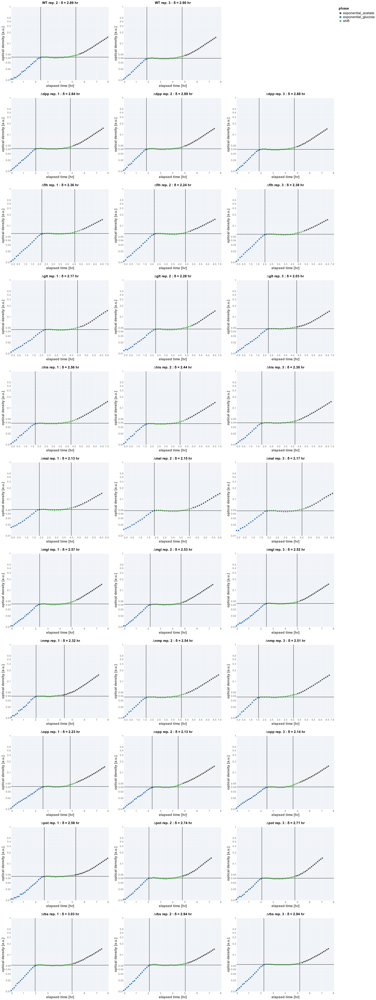

# 2021-09-12 (Run 1) Single KO Glucose-Acetate Diauxic Shift

## Purpose
This is an experiment measuring the lag-time for the single KOs of  "useless" proteins 
during the glucose-acetate diauxic shfit in minimal medium.

## Materials

### Growth Media
| **Label** | **Buffer Base** | **Carbon Source & Concentration** |
|:--:|:--:|:--:|
| ga_shift | N-C- + micronutrients | 0.6 mM glucose + 30 mM acetate|

### Strains 
| **Label** | **Parent Strain**|  **Genotype** | **Location(s)**|
|:--: | :--:| :--:| :--:|
|∆mal| NCM3722 | malGEFKM+lamB::attL-FRT-attR| `GC032`|
|∆pot| NCM3722 | potFGHI::attL-FRT-attR| `GC049`|
|∆nmp| NCM3722 | nmpC::attL-FRT-attR | `GC052`|
|∆his| NCM3722 | hisJQMP::attL-FRT-attR | `GC047`|
|∆rbs | NCM3722 | rbsDACB::attL-FRT-attR | `GC050`|
|∆dpp | NCM3722 | dppABCDF::attL-FRT-attR | `GC048`|
|∆opp | NCM3722 | oppABCDF::attL-FRT-attR | `GC053`|
|∆mgl| NCM3722 | mglBAC::attL-FRT-attR | `GC055`|
|∆glt | NCM3722 | gltIJKL::attL-FRT-attR | `GC030`|
|∆flh | NCM3722 | flhDC::attL-FRT-attR | `GC029`|
|WT| NCM3722 | | `GC001`|

### Instrument Settings
| Instrument | BioTek Epoch2 Microplate Reader|
|:--:| :--:|
| Temperature| 37° C|
| Shaking Speed| 1096 cpm (1mm) |
| Shaking Mode | Linear |
| Shaking Duration| 7m00s|
|Read Speed| Normal|
| Read Time | 0m32s|
| Total Interval | 7m32s |
| Number of Measurements |  96| 

### Plate Layout
| **Wells** | **Label** | **Identifier** |
|:--: | :--:  | :--: |
|C3, D3, E3 | ∆mal | `GC032` | 
|C4, D4, E4 | ∆pot | `GC049` |
|C5, D5, E5 | ∆nmp | `GC052` |
|C6, D6, E6 | ∆his | `GC047` |
|C7, D7, E7 | ∆rbs | `GC050` |
|C8, D8, E8 | ∆dpp | `GC048`| 
|C9, D9, E9 | ∆opp | `GC053` |
|C10, D10, E10 | ∆mgl| `GC055` |
|F3, F4, F5 | ∆glt | `GC030` |
|F6, F7, F8 | ∆flh | `GC029` |
|F9, F10, F11 | WT | `GC001` |

## Notes & Results
Technical replicate 1 for the WT sample showed a very obvious problem in measurement
with a non-monotonic change in the OD for the exponential phase growth on glucose. 
This replicate was dropped from processing and analysis. 

### Lag Time Inference

| **Strain** | **Glucose growth rate, µ [hr]** | **Acetate growth rate, µ [per hr]** | **Lag Time, δ [hr]** | 
|:--: |:--:| :--: | :--: |
|∆mal | 0.66 ± 0.04| 0.55 ± 0.05| 2.15 ± 0.02|
|∆pot | 0.64 ± 0.06| 0.49 ± 0.07| 2.68 ± 0.09 |
|∆nmp | 0.76 ± 0.07| 0.50 ± 0.04| 2.5 ± 0.1|
|∆his | 0.75 ± 0.02| 0.512 ± 0.009| 2.46 ± 0.09|
|∆rbs | 0.77 ± 0.04| 0.4077 ± 0.0005| 2.97 ± 0.05|
|∆dpp | 0.70 ± 0.02| 0.468 ± 0.003| 2.87 ± 0.03|
|∆opp | 0.53 ± 0.03| 0.432 ± 0.008| 2.17 ± 0.05 | 
|∆mgl | 0.62 ± 0.04| 0.572 ± 0.009| 2.54 ± 0.02|    
|∆glt | 0.64 ± 0.01| 0.54 ± 0.08| 2.2 ± 0.1| 
|∆flh | 0.80 ± 0.02| 0.43 ± 0.009| 2.33 ± 0.08 |
|WT   | 0.65 ± 0.06| 0.468 ± 0.004| 2.891 ± 0.007|

### Plots

## Protocol 
1. Precultures were prepared by inoculating 3 mL of N-C- minimal medium (10 mM glucose) + 3 µL of LB with a single colony from a fresh (< 2 week old) plate.
2. Precultures were grown for 5 hours at 37° C with 250 rpm shaking until an OD 
of ≈ 0.5 was reached.
3. 1 mL of each preculture was transferred to a eppendorf tube and centrifuged 
 at 13 xg for 60 seconds. Supernatant was removed.
4. The cell pellet was resuspended with 1 mL of N-C- + 0.6 mM glucose + 30 mM acetate.
This washing step was repeated once more. 
5. THe cell pellet was resuspended in 1 mL of N-C- + 0.6 mM glucose + 30 mM acetate 
and was further diluted 1:20 into fresh shift medium prewarmed to 37° C.
4. A fresh 96 well plate was filled with water in blank wells. The remaining wells 
were filled with 200 µL of diluted and mixed cultures as appropriate and described in 
the section "Plate Layout".
5. The lid of the plate was loosely sealed to the plate by applying 4 strips of 
lab tape to the sides, preventing grinding of the plate while shaking. 
6. Plate was placed in the BioTek Epoch2 Plate reader and a kinetic cycle was begun 
as described in "Instrument Settings".
7. Data was saved, backed-up, exported, and analyzed using the `processing.py` and 
`analysis.py` Python scripts.
